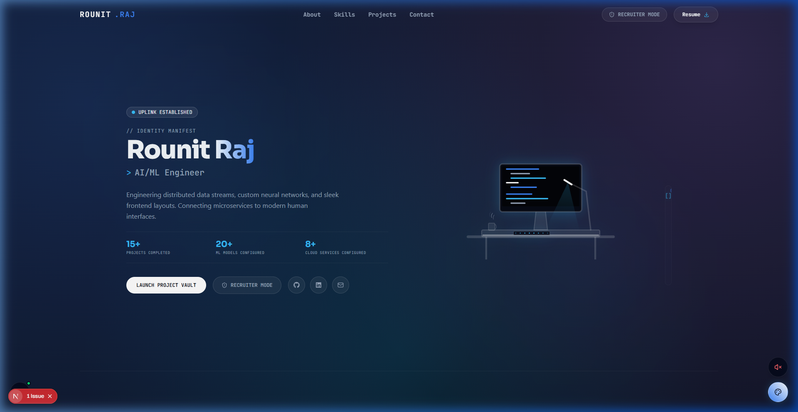
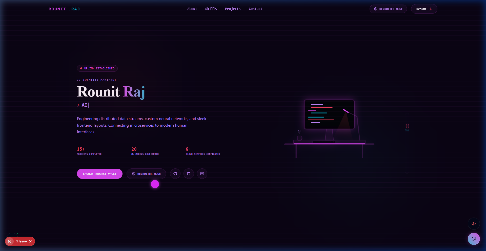

<p align="center">
  
</p>

<h1 align="center">🌌 Interactive Developer Experience — Portfolio</h1>

<p align="center">An immersive, game-inspired developer portfolio designed to showcase projects, skills, and metrics with high-performance animations, dynamic themes, and a real-time audio synthesizer.</p>

---

## 📸 Previews

### Light & Elegant Theme (Liquid Glass)


### Cyberpunk & Retro Theme


---

## ⚡ Key Features

*   **🎮 6 Theme Universes**: Toggle dynamically between distinctive visual themes:
    *   **Liquid Glass**: Frosted-glass minimalist layout with glowing fluid gradient spheres.
    *   **Cosmos**: Orbiting celestial vortex particles responding to mouse parallax.
    *   **Cyberpunk**: Neon grids, cascading matrix rain, and glowing nodes.
    *   **Blueprint**: Architectural CAD drafts, technical grids, and mechanical schematics.
    *   **Illustration**: Playful, wobbly vector cartoon shapes.
    *   **Gaming HUD**: Tactical scanline overlays and crosshair telemetry.
*   **🎹 Real-time Audio Synth Engine**: Powered by the Web Audio API to produce customized, interactive synth sound profiles for each theme switch, hover effects, and game loops.
*   **🏎️ Staggered Spring Reveal Animations**: Premium letter-by-letter spring text loading sequences on page initialization.
*   **⏱️ High-Performance Stats Counter**: Precision `requestAnimationFrame` stats counting that triggers immediately after name reveal animations, utilizing `easeOutQuad` deceleration.
*   **📈 Achievements & Terminal Engine**: Interactive drop-down console terminal (`Ctrl + ~`) supporting shell commands, achievements tracking, and custom notifications.

---

## 🛠️ Technology Stack

-   **Framework**: [Next.js 16 (App Router / Turbopack)](https://nextjs.org/)
-   **Library**: [React 19](https://react.dev/)
-   **Styling**: [Tailwind CSS v4](https://tailwindcss.com/)
-   **Animations**: [Framer Motion](https://www.framer.com/motion/)
-   **State Management**: [Zustand](https://github.com/pmndrs/zustand)
-   **Audio**: Web Audio API (Oscillators, Gains, Filters)
-   **Graphics**: HTML5 Canvas 2D (optimized pixel matrices, stars, and grid calculations)

---

## 🚀 Getting Started

### Prerequisites

Make sure you have [Node.js](https://nodejs.org/) installed (v18.x or higher recommended).

### Installation

1. Clone your repository:
   ```bash
   git clone https://github.com/Marvel-Spiderman/my-portfolio.git
   cd my-portfolio
   ```

2. Install dependencies:
   ```bash
   npm install
   ```

3. Run the development server:
   ```bash
   npm run dev
   ```
   Open [http://localhost:3000](http://localhost:3000) with your browser to see the result.

### Build for Production

To create an optimized production bundle:
```bash
npm run build
```
This generates a static, server-optimized build output inside the `.next` directory.

---

<p align="center">Made with ❤️ by <a href="https://github.com/Marvel-Spiderman">Rounit Raj</a></p>
